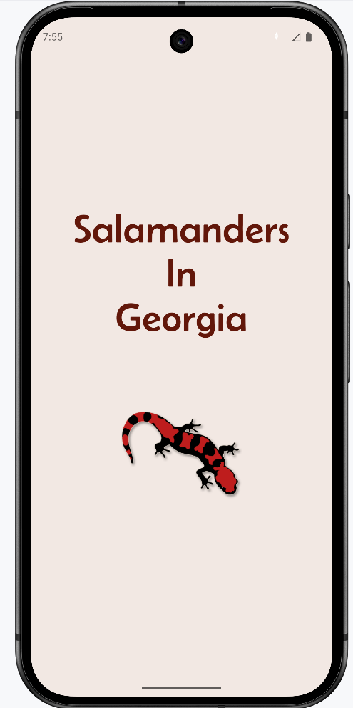
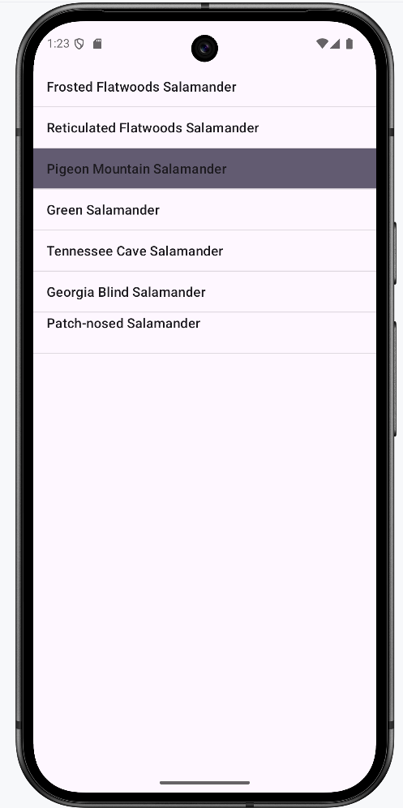
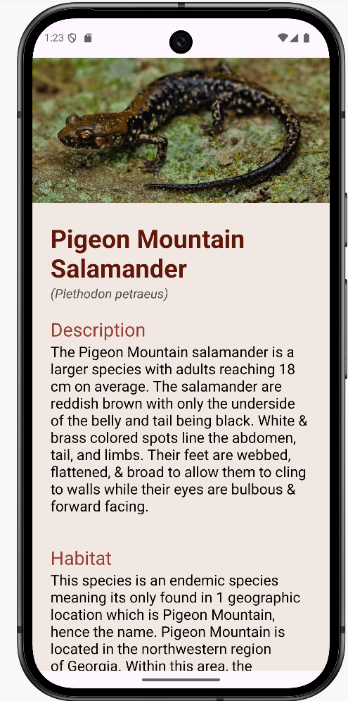
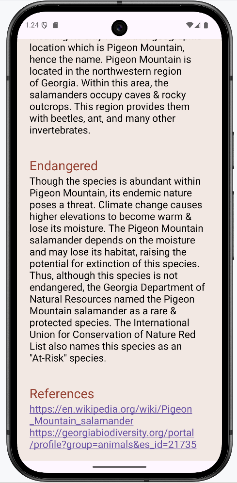
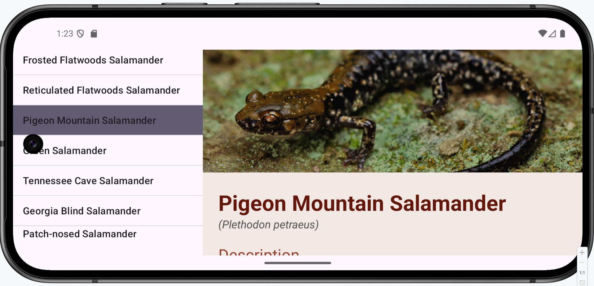
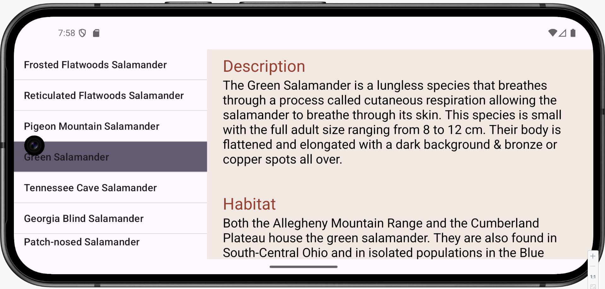

# Salamanders In Georgia
Android application built using Java & Android Studio that demonstrates modern Android development practices, including fragments, XML layouts, & data display.
This app allows users to pick a salamander species from a list to then view details about it through a user-friendly interface.

## Fetaures
- Fragment based navigation
- Compatible with both portrait & landscape orientations
- Clean & responsive XML layouts
- Dynamic content display

## Screenshots
#### Splash Screen

#### Portrait Orientation

#### Landscape Orientation

## Technologies Used
- Language: Java
- IDE: Android Studio
- Build System: Gradle
- UI Layouts: XML
- Testing Environment: Android Emulator

## Prerequisites
- Android Studio installed (version 2025.1.4 or newer)
- JDK 17+
- Android SDK installed

## Setup
1. Clone this repository
> git clone https://github.com/nehaau2305/SalamandersInGeorgia.git
2. Open the project in Android Studio
3. Allow Android Studio to sync Gradle to ensure all dependencies are installed
4. Add a new device in the Device Manager to run the emulator or connect a physical Android device
5. Run the application using the "Run 'app'" button in the toolbar
